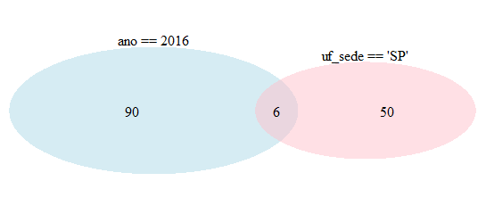

```{r include=F}
library(tidyverse)
library(rio)
```


# Utilizando pacotes

## Instalando e carregando pacotes

&nbsp;
&nbsp;

O R possui uma série de funções que já vêm junto com a sua instalação, como a mean(), seq(), round(), c(), data.frame() e as demais já utilizadas. 

Para utilizar outras funções além dessas, é preciso instalar pacotes ou bibliotecas e carregá-las.

&nbsp;
&nbsp;

```{r}
#install.packages("tidyverse")
#install.packages("rio")
#library(tidyverse)
#library(rio)
```

<div style="float: left; width: 40%;">
<p style="border:3px; border-style:dashed; border-color:#3D9970; padding: 1em;font-size:20px;"> <strong> Obs: </strong> Os pacotes devem ser carregados toda vez que o R for iniciado </p>
</div>

## Utilizando as funções dos pacotes

&nbsp;
&nbsp;

Existem duas formas de se utilizar as funções dos pacotes.

&nbsp;
&nbsp;

* A primeira delas já foi explicada. Basta instalar e carregar o pacote que as funções já podem ser imediatamente utilizadas. 

* A segunda é utilizando o nome do pacote seguido de dois pontos duplicados -> dplyr:: OU rio::


<div style="float: left; width: 50%;">
<p style="border:3px; border-style:dashed; border-color:#001f3f; padding: 1em;font-size:20px;"> Caso surja alguma dúvida a respeito do pacote instalado, uma boa opção é consultar o site abaixo: </br> <a href="https://rdrr.io/"> R Package Documentation </a>  </p>
</div>


# Utilizando dados externos ao R

## Escolhendo o diretório - 1ª opção

&nbsp;
&nbsp;

<center></center>

## Escolhendo o diretório - 2ª opção

&nbsp;
&nbsp;

É possível identificar o diretório em que o R está operando utilizando a função getwd()

```{r, class.source="code"}
getwd()
```

&nbsp;
&nbsp;

E alterar o diretório utilizando a função setwd(). 


```{r, class.source="code"}
setwd("C:\\Users\\t0080390\\Downloads\\curso_r\\aula2") #1º forma
setwd("C:/Users/t0080390/Downloads/curso_r/aula2") #2º forma
```

<div style="float: left; width: 40%;">
<p style="border:3px; border-style:dashed; border-color:#F08080; padding: 1em;font-size:20px;"> <strong> IMPORTANTE: </strong> as barras do caminho do diretório devem ser duplicadas ou invertidas </p>
</div>

## Importando planilhas 

&nbsp;
&nbsp;

Para utilizar uma planilha de excel no R devemos importá-la para o ambiente.

&nbsp;
&nbsp;

Existem diversas funções para importar planilhas, incluindo algumas próprias do R (como a read.csv ou read.csv2).

&nbsp;
&nbsp;

No entanto, iremos utilizar a função import() do pacote rio que já foi instalado, uma vez que ela permite a importação de um maior número de extensões de documentos (.csv, .xslx, .ods, etc.)

## Importando planilhas

Existem dois modos de se importar uma planilha:

```{r}

#O primeiro deles é fixando o diretório e depois utilizar a função import()
setwd("T:\\COVAD\\Curso R\\Aula 2")
jn <- import("jn.xlsx") #Base do relatório Justiça em Números 2019

head(jn[1:5])

#O segundo é inserindo o caminho do diretório diretamente na função
jn <- import("T:\\COVAD\\Curso R\\Aula 2\\jn.xlsx")
head(jn[1:5])
```

## Exportando planilhas

&nbsp;
&nbsp;

As planilhas também podem ser exportadas para o diretório desejado utilizando a função export()

&nbsp;
&nbsp;

```{r}

#O primeiro deles é fixando o diretório e depois utilizar a função export()
#setwd("T:\\COVAD\\Curso R\\Aula 2")
#export(jn, "teste1.csv") #Base do relatório Justiça em Números 2019

#O segundo é inserindo o caminho do diretório diretamente na função
#export(jn, "T:\\COVAD\\Curso R\\Aula 2\\teste2.csv")

#É possível também salvar a planilha em outra extensão, como xlsx:
#export(jn, "T:\\COVAD\\Curso R\\Aula 2\\teste3.xlsx")
```

# Introdução ao Tidyverse

##

<center></center>


## Dplyr


&nbsp;
&nbsp;

Nesta aula, focaremos nos pacotes Dplyr e Tidyr, mas ainda passaremos pelo ggplot e stringr nas próximas. 

O Dplyr (d para *data frames* e plyr para *pliers*) é a gramática da manipulação de dados, contendo uma série de verbos (funções) que permitem resolver a maior parte dos desafios relacionados à manipulação.

Ao longo desta aula, passaremos pelas seguintes funções:


&nbsp;
&nbsp;

<div style="float: left; width: 40%;">

* filter()

* slice ()

* select()

* arrange()

</div>


<div style="float: right; width: 50%;">

* mutate()

* summarise()

* group_by()

</div>


# Select()

## Selecionando as colunas da planilha - Revisão

&nbsp;
&nbsp;

Na primeira aula, aprendemos a selecionar as colunas de uma base utilizando colchetes

&nbsp;
&nbsp;

```{r}

#Selecionar as colunas pelo indexador

jn1 <- jn[,c(1,2,3)]
dim(jn1)

#Selecionar as colunas pelos nomes

jn1 <- jn[,c("ano", "justica","sigla")]
dim(jn1)
```

## Selecionando as colunas da planilha com select()

<div style="float: right; width: 30%;">
<p style="border:3px; border-style:dashed; border-color:#FF4136; padding: 1em;font-size:20px;"> <strong> IMPORTANTE: </strong> o primeiro argumento de todas as funções é sempre a base de dados </p>
</div>

&nbsp;
&nbsp;

Para selecionar colunas com o dplyr basta usar a função select()

```{r}
#Selecionar as colunas pelo indexador
jn1 <- select(jn, 1,2,3)
dim(jn1)

#Selecionar as colunas pelos nomes
jn1 <- select(jn, ano, justica, sigla)
dim(jn1)

#Selecionar as colunas pelo conteúdo do seu nome
jn1 <- select(jn, starts_with("arq"))

```

## Excluindo colunas

&nbsp;
&nbsp;

Para excluir colunas, basta incluir um sinal de negativo (-) antes do nome da coluna

```{r}
dim(jn)

jn1 <- select(jn, -starts_with("arq"))
dim(jn1)
```

&nbsp;
&nbsp;

Para os próximos exercícios, selecione as seguintes colunas: ano, justica, sigla, uf_sede, uf_abrangida, ftt, g1, g10a, g10b, g10c, g10d

```{r}
jn <- select(jn, ano, justica, sigla,regiao, starts_with("uf"),ftt, g1, starts_with("g10"))
```


# Filter()

## Filtrando colunas com colchetes - revisão

&nbsp;
&nbsp;

```{r}
jn1 <- jn[jn$ano==2018,]
head(jn1[1:5], n=5)

jn1 <- jn[jn$uf_abrangida=="Nordeste",]
head(jn1[1:5], n=5)
```


## Filtrando colunas com o dplyr

&nbsp;
&nbsp;

Antes de aprendermos a filtrar, precisamos conhecer os operadores de comparação utilizados no R:

&nbsp;
&nbsp;

<div style="float: left; width: 40%;">

* Igualdade: $==$

* Diferença: $!=$

* Menor que: $<$

</div>


<div style="float: right; width: 50%;">

* Maior que: $>$

* Menor ou igual: $<=$

* Maior ou igual: $>=$

</div>

## Filtrando colunas com o dplyr

&nbsp;
&nbsp;

Lembrem-se, o primeiro argumento das funções do dplyr é **SEMPRE A BASE DE DADOS**

&nbsp;
&nbsp;

```{r}
jn1 <- filter(jn, ano >= 2016)

jn1 <- filter(jn, uf_abrangida == "Sudeste")

jn1 <- filter(jn, uf_abrangida != "Nordeste")
```


## Filtrando múltiplas colunas

É possível filtrar por múltiplas colunas ao mesmo tempo. Para tanto, além dos operadores de comparação, temos que conhecer também os operadores lógicos: ""

* "&" ou a vírgula (,) são sinônimos de **E**, isto é, filtra apenas as observações que cumprem as duas condições

* "|" é um sinônimo de **OU**, ou seja,  filtra as observações que cumprem uma observação ou a outra

<center></center>


## Filtrando múltiplas colunas

&nbsp;
&nbsp;

```{r}
jn1 <- filter(jn, ano == 2016 &  uf_sede == "SP")
nrow(jn1)

jn1 <- filter(jn, ano == 2016 |  uf_sede == "SP")
nrow(jn1)
```

## Filtrando por múltiplos valores

&nbsp;
&nbsp;

Para filtrar múltiplos valores de uma única coluna é necessário usar o operador %in%

&nbsp;
&nbsp;

```{r}
jn1 <- filter(jn, ano %in% c(2016,2018))

jn1 <- filter(jn, sigla %in% c("TJMG", "TJSP", "TJRJ", "TJRS") &
                g10d>7000)
```

# Slice()

## Selecionando linhas

&nbsp;
&nbsp;

A função slice() serve para selecionar linhas específicas da base de dados

&nbsp;
&nbsp;


```{r}

jn1 <- slice(jn, 1:5) #seleciona da primeira à quinta linha


jn1 <- slice(jn, 890:n()) #seleciona da 890 à última linha


jn1 <- slice(jn, -1:-4) #Exclui as 4 primeiras linhas
```

# Arrange()

## Ordenando a base de dados

&nbsp;
&nbsp;

A função arrange() corresponde à classificação da base de dados a partir dos valores das colunas. Assim como no Excel, é possível classificar uma ou mais colunas em ordem crescente ou decrescente (basta colocar o nome da coluna dentro do argumento *desc()*).


```{r}
jn1 <- arrange(jn, ano, uf_sede)
head(jn1, n=5)


jn1 <- arrange(jn, desc(ano), ftt)
head(jn1, n=5)
```


# Mutate()

## Criando novas colunas

&nbsp;
&nbsp;

O objetivo da função mutate() é permitir criar novas colunas a partir das já existentes

&nbsp;
&nbsp;

```{r}
#Criar uma nova coluna que corresponde à média de despesa por funcionário
jn1 <- mutate(jn, med_func= (g10a+g10b+g10c+g10d)/4)


#Criar uma nova coluna que corresponde a quantas vezes as categorias de funcionários ganham em relação às outras

jn1 <- mutate(jn, mag_serv= (g10a/g10b), serv_terc=(g10b/g10c), terc_est=(g10c/g10d))
jn1 %>% filter (ano==2017, justica=="Estadual") %>% select(3,13,14,15) %>%  head(n=5)

```

# Summarise()

## Estatísticas sumárias da base

&nbsp;
&nbsp;

A função summarise() visa obter estatísticas da base por colunas

<center></center>

## Summarise()

Por exemplo, podemos obter a média das despesas por magistrados, servidores, terceirizados ou estagiários

```{r}

summarise(jn, media_mag=mean(g10a, na.rm=T))

summarise(jn, media_serv=mean(g10b, na.rm=T))

summarise(jn, media_ter=mean(g10c, na.rm=T))

summarise(jn, media_est=mean(g10d, na.rm=T))

```


# group_by()


## Realizando manipulações por grupo

&nbsp;
&nbsp;

Todas as manipulações realizadas até então podem ser aplicadas a grupos, ao invés de aplicadas à base de dados inteira 

<center></center>


## Combinando o group_by com as outras funções

&nbsp;
&nbsp;

Como descobrir quais são 5 Tribunais que pagam os melhores salários aos servidores em 2018?

```{r}
jn1 <- filter(jn, ano==2018)
jn1 <- arrange(jn1, desc(g10b))
jn1 <- slice(jn1, 1:5) #Esses códigos podem ser substituídos pela função top_n
jn1$sigla
```

Como descobrir quais são 3 Tribunais que pagam os melhores salários aos servidores por justiça?

```{r}
jn1 <- filter(jn, ano==2018)
jn1 <- group_by(jn1, justica) #Agrupando por justiça
jn1 <- arrange(jn1, desc(g10b)) #Após agrupar, o restante do algoritmo é o mesmo
jn1 <- slice(jn1, 1:3)
jn1[c(2,3)]
```

## Combinando o group_by com as outras funções

Já calculamos qual é a média geral dos salários dos servidores. Agora, qual é a média dos salários dos servidores por região em 2018?

```{r}
jn1 <- filter(jn, ano==2018)
jn1 <- group_by(jn1, regiao)
jn1 <- summarise(jn1, med_venc=mean(g10b, na.rm=T))
jn1 <- arrange(jn1, desc(med_venc))
jn1
```

E por justiça?

```{r}
jn1 <- filter(jn, ano==2018)
jn1 <- group_by(jn1, justica)
jn1 <- summarise(jn1, med_venc=mean(g10b, na.rm=T))
jn1 <- arrange(jn1, desc(med_venc))
jn1
```

## Combinando o group_by com as outras funções

&nbsp;
&nbsp;

E por justiça e região? Sim, é possível agrupar por mais de uma coluna

```{r}
jn1 <- filter(jn, ano==2018)
jn1 <- group_by(jn1, justica, regiao)
jn1 <- summarise(jn1, med_venc=mean(g10b, na.rm=T))
jn1 <- arrange(jn1, desc(med_venc), justica, regiao)
jn1
```

# Bônus: pipe %>% 

## Aninhando funções 

&nbsp;
&nbsp;

Em várias situações, precisaremos utilizar várias funções para completar um único objetivo: média de salário dos serviores por região, por exemplo. 

Para evitar termos que criar vários objetos ou sobrescrever um deles várias vezes, podemos aninhar funções.

```{r}
#Calcular a média da proporção de salários dos magistrados em relação aos servidores por região em 2018

jn1 <-   arrange(summarise(group_by(mutate(filter(jn, ano==2018), mag_serv=g10a/g10b), regiao),med_mag_serv=mean(mag_serv, na.rm = T)), desc(med_mag_serv))
jn1
```

<center>  </center>

## Aninhando funções com o pipe

&nbsp;
&nbsp;

Ao invés de concatenar inúmeras funções deixando o código totalmente ilegível, podemos usar o operador pipe $%>%$ através do atalho ctrl+shift+m.  

Em termos simples, o operador pipe "pega" o resultado da operação anterior e o utiliza como o input do primeiro argumento da função seguinte. É justamente por isso que ele é tão útil combinado com as funções do dplyr: **todas as funções geram um data frame e demandam como primeiro argumento um data frame!!!**

&nbsp;
&nbsp;

<center>  </center>

## Aninhando funções com o pipe

```{r}

jn1 <- jn %>% filter(ano==2018) %>% mutate(mag_serv=g10a/g10b) %>% 
              group_by(regiao) %>% summarise(med_mag_serv=mean(mag_serv, na.rm = T)) %>% 
              arrange(desc(med_mag_serv))
jn1
```

<center>  </center>